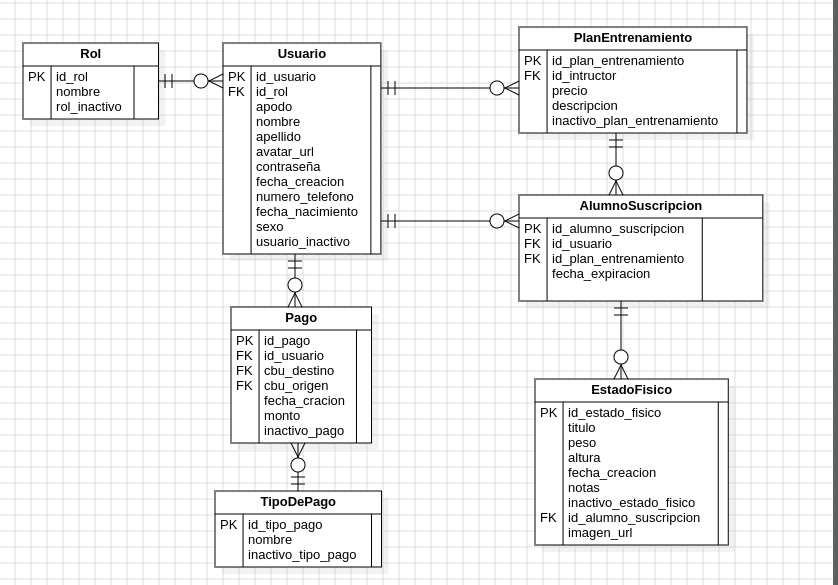

# Base de datos Para GYMSY 
En el siguiente repositorio encontrara todo lo nesesario para montar el siguiente modelo de base de datos con los procedimientos,triggers, etc.

Para el correcto funcionamiento de la base de datos se debe seguir los siguientes pasos 

1 Cargar el  [Modelo base](./src/modelo_base.sql)

2 Cargar los  [Modelos de  Auditoria](./src/modelos_auditoria.sql)

3 Cargar los  [Triggers](./src/triggers/)

4 Cargar los  [Procedimientos Almacenados](./src/procedimientos/)

